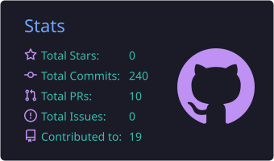
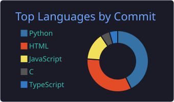
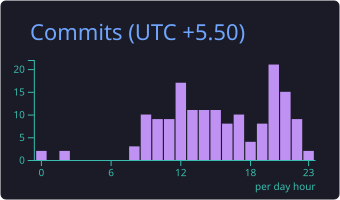
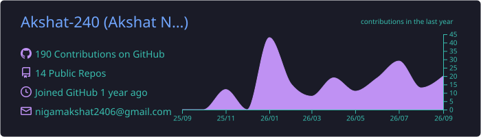

  

  
  

 

<!-- Trophies -->

  

 

### 👨‍💻 About Me

- 🔭 I’m currently working on **Cloud Computing & Automation**
- 🌱 I’m currently learning **AI/ML** and **Advanced DevOps**
- ☁️ Experienced with **Azure** & **Nutanix**
- ⚡ Fun fact: **I can deploy a cluster faster than I can decide what to eat.**

---

### 🛠️ Tech Stack

  
  <!-- Languages -->
  
  
  
  
  
   

  <!-- Cloud/DevOps -->
  
  
  
  

---

### 📊 GitHub Stats

  <!-- Stats Card -->
  
   
  <!-- Top Languages & Productive Time -->
  
  

  <!-- Profile Details -->
  

 

<!-- Snake Animation -->

  <picture>
    <source media="(prefers-color-scheme: dark)" srcset="https://raw.githubusercontent.com/Akshat-240/Akshat-240/output/github-contribution-grid-snake-dark.svg">
    <source media="(prefers-color-scheme: light)" srcset="https://raw.githubusercontent.com/Akshat-240/Akshat-240/output/github-contribution-grid-snake.svg">
    
  </picture>

---

### 📂 Projects

| Project | Description | Tech Stack |
| :--- | :--- | :--- |
| **[SkillGap-AI](https://github.com/Akshat-240/SkillGap-AI)** | AI-powered resume and job description matching system. | 🐍 Python, AI |
| **[Secure-college-portal](https://github.com/Akshat-240/Secure-college-portal)** | Secure web-based authentication system for college portals. | 🔐 HTML, Security |
| **[Grocery Management](https://github.com/Akshat-240/Grocery_Management_System_Project_62)** | A comprehensive system for managing grocery inventories. | 🛒 C, Management |
| **[Astreal](https://github.com/Akshat-240/Astreal)** | Original project demonstrating creative development. | 🌟 Public |
